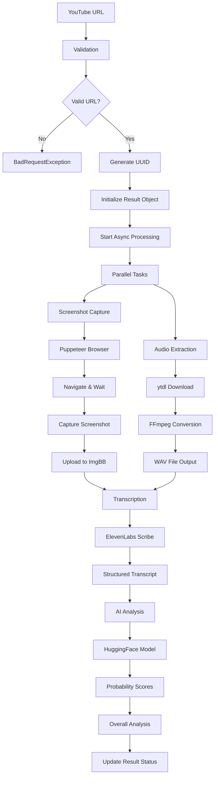

# YouTube AI Content Detection Service

A comprehensive Node.js service that analyzes YouTube videos to detect AI-generated content through audio transcription and text analysis. The service captures video screenshots, extracts audio, performs speech-to-text with speaker diarization, and runs AI content detection on the transcript.

## 🚀 Features

- **YouTube Video Processing**: Validates and processes YouTube URLs
- **Screenshot Capture**: Uses Puppeteer to capture video thumbnails with playback verification
- **Audio Extraction**: Downloads and converts audio tracks to optimal format (16kHz, mono, 16-bit WAV)
- **Speech-to-Text**: Utilizes ElevenLabs Scribe for high-quality transcription with:
  - Word-level timestamps
  - Speaker diarization
  - Multi-language support
- **AI Content Detection**: Enhanced text analysis with Vietnamese language support
- **Async Processing**: Non-blocking analysis with status tracking
- **REST API**: Simple endpoints for submission and result retrieval
- **Image Hosting**: Automatic screenshot upload to ImgBB with fallback handling

## 🛠 Tech Stack

- **Framework**: NestJS with TypeScript
- **Video Processing**: ytdl-core, FFmpeg
- **Browser Automation**: Puppeteer
- **Speech Recognition**: ElevenLabs Scribe API
- **AI Detection**: Custom Vietnamese-enhanced model on HuggingFace
- **Image Storage**: ImgBB API
- **File System**: Temporary file management

## 📋 Prerequisites

- Node.js 16+ 
- FFmpeg installed
- Chrome/Chromium for Puppeteer

## ⚡ Quick Setup

```bash
# Clone and setup everything
bash setup.sh
```

The setup script handles all dependencies and configuration automatically.

## 🔧 Environment Variables

Create a `.env` file with:

```env
# ElevenLabs API for speech-to-text
ELEVENLABS_API_KEY=your_elevenlabs_api_key

# ImgBB for screenshot hosting
IMGBB_API_KEY=your_imgbb_api_key
IMGBB_EXPIRATION=86400  # Optional: image expiration in seconds

# AI Detection Service (Vietnamese-enhanced model)
AI_DETECTION_URL=https://huggingface.co/spaces/skyoi1212/ai-detection
AI_DETECTION_TIMEOUT=15000

# Server Configuration
PORT=3000
```

## 🏗️ System Architecture

### High-Level Architecture

```
┌─────────────────┐    ┌──────────────────┐    ┌─────────────────┐
│   Client/Web    │───▶│   NestJS API     │───▶│  Analysis Flow  │
│   Application   │    │   Controller     │    │   (Async)       │
└─────────────────┘    └──────────────────┘    └─────────────────┘
                              │
                              ▼
                    ┌──────────────────┐
                    │  Analysis Service │
                    │  (In-Memory Store)│
                    └──────────────────┘
                              │
                ┌─────────────┼─────────────┐
                ▼             ▼             ▼
    ┌─────────────────┐ ┌─────────────┐ ┌──────────────┐
    │  Video Processing│ │ Screenshot  │ │ Audio Extract│
    │   (ytdl-core)   │ │ (Puppeteer) │ │   (FFmpeg)   │
    └─────────────────┘ └─────────────┘ └──────────────┘
                │             │             │
                └─────────────┼─────────────┘
                              ▼
                    ┌──────────────────┐
                    │  File Management │
                    │  (temp storage)  │
                    └──────────────────┘
                              │
    ┌─────────────────────────┼─────────────────────────┐
    ▼                         ▼                         ▼
┌─────────────┐    ┌──────────────────┐    ┌─────────────────┐
│ ElevenLabs  │    │     ImgBB        │    │  HuggingFace    │
│   Scribe    │    │   Image Host     │    │  AI Detection   │
│ (Speech2Text)│   │  (Screenshots)   │    │  (Vietnamese)   │
└─────────────┘    └──────────────────┘    └─────────────────┘
```

### Component Architecture

#### 1. **API Layer (NestJS)**
```typescript
AnalysisController
├── POST /analyze           → Initiates async analysis
├── GET /result/:id         → Returns complete results  
└── GET /status/:id         → Checks processing status
```

#### 2. **Service Layer (AnalysisService)**
```typescript
Core Components:
├── Video Validation        → ytdl.validateURL()
├── Async Task Manager      → Promise-based processing
├── Result Storage          → In-memory Map<string, AnalysisResultDto>
├── Cache System           → Map<string, number> for AI probabilities
└── File Management        → Temporary file lifecycle
```

#### 3. **Processing Pipeline**

**Phase 1: Parallel Initialization**
```
YouTube URL Input
        │
        ├─── Screenshot Capture (Puppeteer)
        │    ├── Launch headless browser
        │    ├── Navigate to video URL
        │    ├── Wait for playback verification
        │    ├── Capture 1280x720 PNG
        │    └── Upload to ImgBB
        │
        └─── Audio Extraction (ytdl + FFmpeg)
             ├── Download highest quality audio
             ├── Convert to WAV (16kHz, mono, 16-bit)
             └── Save to temp directory
```

**Phase 2: Content Analysis**
```
Audio File (WAV)
        │
        ▼
ElevenLabs Scribe API
├── Speech-to-Text conversion
├── Word-level timestamps  
├── Speaker diarization
└── Structured transcript
        │
        ▼
AI Content Detection
├── Text segmentation
├── Vietnamese-enhanced model
├── Probability scoring (0.0-1.0)
└── Results caching
```

**Phase 3: Analysis Compilation**
```
Raw Results Aggregation
        │
        ▼
Overall Analysis Calculator
├── Average AI probability
├── Confidence level determination
├── Sentence-level statistics
├── Decision rationale generation
└── Perplexity metrics (placeholder)
```

### Data Flow Architecture

#### Request Flow
1. **Client** submits YouTube URL via POST /analyze
2. **Controller** validates input and delegates to service
3. **Service** generates unique ID and starts async processing
4. **Response** returns immediately with processing ID
5. **Client** polls GET /status/:id or GET /result/:id

#### Processing Flow


### External Service Integration

#### 1. **ElevenLabs Scribe Integration**
```typescript
Features Used:
├── Model: scribe_v1
├── Input: WAV audio buffer as Blob  
├── Output: Word-level transcript with timestamps
├── Capabilities: Speaker diarization, multi-language
└── Error Handling: Graceful fallback on API failures
```

#### 2. **HuggingFace AI Detection**
```typescript
Custom Vietnamese-Enhanced Model:
├── Endpoint: https://huggingface.co/spaces/skyoi1212/ai-detection
├── Input: Text sentences for analysis
├── Output: Binary classification (0=Human, 1=AI)
├── Enhancement: Optimized Vietnamese language patterns
└── Caching: Hash-based result storage for efficiency
```

#### 3. **ImgBB Image Hosting**
```typescript
Screenshot Management:
├── Upload: Base64 encoded PNG images
├── Expiration: Configurable via IMGBB_EXPIRATION
├── Fallback: Placeholder URLs on upload failures
└── Error Handling: Graceful degradation
```

### Storage Architecture

#### In-Memory Storage
```typescript
Results Store: Map<string, AnalysisResultDto>
├── Key: UUID generated per analysis
├── Value: Complete analysis result object
├── Lifecycle: Persistent until service restart
└── Status Tracking: processing → completed/error

Cache Store: Map<string, number>  
├── Key: Hash of analyzed text
├── Value: AI probability score
├── Purpose: Avoid duplicate API calls
└── Optimization: Reduces external API usage
```

#### Temporary File Management
```typescript
File System Structure:
/temp/
├── {uuid}.wav          → Extracted audio files
├── Auto-cleanup        → Files deleted after processing
├── Error Handling      → Cleanup on process failure
└── Path Management     → Absolute paths with join()
```

### Error Handling & Resilience

#### Graceful Degradation
```typescript
Component Failures:
├── Screenshot Capture  → Placeholder image fallback
├── Audio Extraction   → Detailed error logging
├── Transcription API  → Service unavailable response  
├── AI Detection API   → Default 0.5 probability
└── Image Upload       → Placeholder URL fallback
```

#### Timeout Management
```typescript
Timeout Configuration:
├── Overall Analysis    → 3 minutes maximum
├── Screenshot Capture  → 15 seconds page load
├── AI Detection API    → 15 seconds per request
├── ImgBB Upload       → 30 seconds per image
└── Browser Operations  → Automatic cleanup on timeout
```

### Performance Optimizations

#### Concurrent Processing
- Screenshot capture and audio extraction run in parallel
- Non-blocking async operations throughout pipeline
- Promise.all() for simultaneous external API calls

#### Resource Management  
- Browser instance cleanup after screenshot
- Temporary file deletion after processing
- Memory-efficient audio buffer handling
- Connection pooling for HTTP requests

#### Caching Strategy
- Text analysis results cached by content hash
- Prevents duplicate API calls for similar content
- In-memory cache with automatic string hashing

## 📚 API Endpoints

### POST /analyze
Submit a YouTube video for AI content analysis.

**Request:**
```json
{
  "url": "https://www.youtube.com/watch?v=VIDEO_ID"
}
```

**Response:**
```json
{
  "id": "unique-analysis-id"
}
```

### GET /result/:id
Retrieve complete analysis results.

**Response:**
```json
{
  "id": "analysis-id",
  "videoUrl": "https://youtube.com/watch?v=...",
  "screenshotPath": "https://i.ibb.co/screenshot.png",
  "transcript": [
    {
      "text": "Hello world",
      "start_time": 0.5,
      "end_time": 1.2,
      "speaker": "Speaker_1",
      "ai_probability": 0.85
    }
  ],
  "overallAnalysis": {
    "overall_ai_probability": 0.72,
    "overall_prediction": "AI-Generated Content",
    "confidence_level": "high",
    "decision_rationale": "15 AI-like, 3 human-like segments",
    "sentence_stats": {
      "total_sentences": 18,
      "ai_sentences": 15,
      "human_sentences": 3,
      "neutral_sentences": 0,
      "average_sentence_ai_probability": 0.72
    }
  },
  "status": "completed",
  "createdAt": "2024-01-01T12:00:00.000Z"
}
```

### GET /status/:id
Check analysis progress.

**Response:**
```json
{
  "status": "processing|completed|error",
  "error": "Error message if failed"
}
```

## 🎯 Analysis Pipeline

1. **URL Validation**: Verifies YouTube URL format
2. **Parallel Processing**:
   - **Screenshot Capture**: Puppeteer loads video, waits for playback, captures thumbnail
   - **Audio Extraction**: ytdl-core downloads audio → FFmpeg converts to WAV
3. **Transcription**: ElevenLabs Scribe processes audio with speaker diarization
4. **AI Detection**: Each text segment analyzed through Vietnamese-enhanced model
5. **Result Compilation**: Generates comprehensive analysis with confidence metrics

## 🌟 Enhanced Vietnamese AI Detection

The service uses a custom-trained model deployed on HuggingFace that includes:
- **Vietnamese Language Support**: Optimized for Vietnamese text patterns
- **Improved Accuracy**: Enhanced detection for mixed-language content
- **Contextual Analysis**: Better understanding of Vietnamese linguistic structures
- **Fallback Handling**: Graceful degradation for API timeouts

## 📊 Analysis Metrics

- **AI Probability**: 0.0 (human) to 1.0 (AI-generated)
- **Confidence Levels**: High, Medium, Low based on consistency
- **Speaker Diarization**: Identifies multiple speakers in audio
- **Temporal Analysis**: Word-level timestamps for precise detection
- **Statistical Summary**: Comprehensive sentence-level statistics

## 🔄 Processing States

- **`processing`**: Analysis in progress
- **`completed`**: Analysis finished successfully  
- **`error`**: Analysis failed with error message

## ⚙️ Configuration Options

- **Timeout**: 3-minute maximum processing time
- **Audio Quality**: Configurable sample rate and bit depth
- **Cache System**: Text analysis results cached for efficiency
- **Error Handling**: Comprehensive fallback mechanisms
- **Temporary Files**: Automatic cleanup after processing

## 🛡️ Error Handling

- Invalid YouTube URLs rejected immediately
- Screenshot failures fallback to placeholder images
- Audio extraction errors properly logged and reported
- API timeouts handled gracefully with default probabilities
- Temporary file cleanup ensures no storage leaks

## 🚦 Usage Example

```javascript
// Submit video for analysis
const response = await fetch('/analyze', {
  method: 'POST',
  headers: { 'Content-Type': 'application/json' },
  body: JSON.stringify({ 
    url: 'https://www.youtube.com/watch?v=dQw4w9WgXcQ' 
  })
});

const { id } = await response.json();

// Check status periodically
const checkStatus = async () => {
  const statusResponse = await fetch(`/status/${id}`);
  const { status } = await statusResponse.json();
  
  if (status === 'completed') {
    const resultResponse = await fetch(`/result/${id}`);
    const analysis = await resultResponse.json();
    console.log('Analysis complete:', analysis);
  }
};
```

## 📈 Performance Considerations

- **Parallel Processing**: Screenshot and audio extraction run concurrently
- **Caching**: Text analysis results cached to avoid duplicate API calls
- **Resource Management**: Automatic cleanup of temporary files and browser instances
- **Timeout Handling**: Prevents hung processes with configurable timeouts
- **Memory Optimization**: Efficient handling of audio buffers and image data

## 🔍 Troubleshooting

- **YouTube Access Issues**: Check if URL is accessible and not region-blocked
- **Audio Extraction Fails**: Verify FFmpeg installation and permissions
- **Screenshot Timeouts**: May occur with slow-loading videos or network issues
- **API Rate Limits**: ElevenLabs and ImgBB have usage restrictions
- **Vietnamese Text Issues**: Model optimized for Vietnamese but supports other languages

## 🤝 Contributing

The Vietnamese AI detection model is continuously improved. Contributions and feedback welcome for:
- Model accuracy improvements
- Additional language support  
- Performance optimizations
- Bug reports and feature requests

## 📄 License

MIT License - see LICENSE file for details.

---

**Note**: This service is designed for research and educational purposes. Ensure compliance with YouTube's Terms of Service and applicable laws when processing video content.
